# Continuity of Care Flow Diagram 🔄

This document provides a visual representation of how continuity of care is implemented in our doctor assignment system.

## Continuity of Care Process Flow

## Continuity Score Calculation Detail

```mermaid
flowchart LR
    A[Past Appointments] --> B[Count Score]
    A --> C[Recency Score]
    A --> D[Department Score]
    
    B[Count Score\n30%] --> E{Count >= 5?}
    E -->|Yes| F[Score = 1.0]
    E -->|No| G[Score = count/5]
    
    C[Recency Score\n50%] --> H{Days Since Last?}
    H -->|Recent| I[High Score]
    H -->|< 1 Year| J[Decaying Score]
    H -->|> 1 Year| K[Score = 0]
    
    D[Department Score\n20%] --> L{Same Department?}
    L -->|Yes| M[Score = 1.0]
    L -->|No| N[Score = 0.5]
    
    F & G --> O[Weighted Count\n0.3 × Count Score]
    I & J & K --> P[Weighted Recency\n0.5 × Recency Score]
    M & N --> Q[Weighted Department\n0.2 × Department Score]
    
    O & P & Q --> R[Combined Score]
    R --> S{Appointment Type}
    S -->|Follow-up| T[Final Score = Combined × 15]
    S -->|Regular| U[Final Score = Combined × 5]
    S -->|Emergency| V[Final Score = 0]
    
    style B fill:#f9f,stroke:#333,stroke-width:2px
    style C fill:#f9f,stroke:#333,stroke-width:2px
    style D fill:#f9f,stroke:#333,stroke-width:2px
    style O fill:#f9f,stroke:#333,stroke-width:2px
    style P fill:#f9f,stroke:#333,stroke-width:2px
    style Q fill:#f9f,stroke:#333,stroke-width:2px
    style R fill:#f9f,stroke:#333,stroke-width:2px
```

## Balancing Continuity with Other Factors

## Testing Continuity of Care

