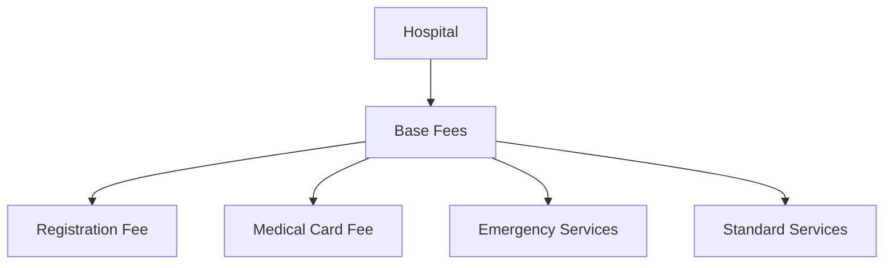

# Fee Setting Guide 💰

## Overview
This guide explains how different entities (hospitals, departments, and doctors) can set and manage their consultation fees in the PHB Management system.

## Fee Setting Hierarchy 🏗️

### 1. Hospital Level Fees


#### Setting Hospital Fees
```python
# Example: Hospital setting base fees
hospital_fee = AppointmentFee.objects.create(
    hospital=hospital,
    fee_type='standard',
    base_fee=5000.00,
    registration_fee=1000.00,
    medical_card_fee=500.00,
    currency='NGN',
    valid_from=date.today()
)
```

### 2. Department Level Fees 🏥

Departments can set specialized fees based on their services:

| Department | Fee Type | Base Multiplier |
|------------|----------|-----------------|
| Cardiology | Specialist | 1.5x base |
| Emergency  | Emergency  | 2.0x base |
| Pediatrics | Standard  | 1.2x base |
| Surgery    | Specialist | 2.5x base |

```python
# Example: Department setting specialized fees
cardiology_fee = AppointmentFee.objects.create(
    hospital=hospital,
    department=cardiology_dept,
    fee_type='specialist',
    base_fee=7500.00,  # 1.5x hospital base fee
    currency='NGN',
    valid_from=date.today()
)
```

### 3. Doctor Level Fees 👨‍⚕️

Individual doctors can set their consultation fees based on:
- Experience level
- Specialization
- Reputation
- Time slots

```python
# Example: Doctor setting personal consultation fee
doctor_fee = AppointmentFee.objects.create(
    hospital=hospital,
    department=cardiology_dept,
    doctor=senior_cardiologist,
    fee_type='specialist',
    base_fee=10000.00,
    currency='NGN',
    valid_from=date.today()
)
```

## Fee Setting Rules 📋

### 1. Priority Order
1. Doctor-specific fees (if set)
2. Department fees (if no doctor fee)
3. Hospital base fees (if no department fee)

### 2. Time-based Variations
```python
# Example: Peak hour pricing
peak_hour_fee = AppointmentFee.objects.create(
    doctor=doctor,
    fee_type='specialist',
    base_fee=12000.00,
    time_slot='peak',  # 9 AM - 11 AM
    currency='NGN',
    valid_from=date.today()
)
```

### 3. Special Service Fees
- Emergency consultations
- After-hours services
- Weekend appointments
- Home visits
- Video consultations

## Fee Setting Interface 🖥️

### 1. Hospital Admin Interface
```python
class HospitalFeeManager:
    def set_base_fees(self):
        """Set hospital-wide base fees"""
        
    def set_department_fees(self):
        """Set department-specific fees"""
        
    def approve_doctor_fees(self):
        """Review and approve doctor fee requests"""
```

### 2. Doctor's Interface
```python
class DoctorFeeManager:
    def request_fee_change(self):
        """Request new fee structure"""
        
    def set_time_slot_fees(self):
        """Set fees for specific time slots"""
        
    def set_special_service_fees(self):
        """Set fees for special services"""
```

## Fee Calculation Examples 🧮

### 1. Standard Consultation
```python
# Regular hours, standard consultation
standard_fee = base_fee + registration_fee
```

### 2. Specialist Consultation
```python
# Specialist consultation with experience multiplier
specialist_fee = (base_fee * experience_multiplier) + registration_fee
```

### 3. Emergency Services
```python
# Emergency consultation after hours
emergency_fee = (base_fee * emergency_multiplier) + emergency_surcharge
```

## Best Practices 🎯

### 1. Fee Setting Guidelines
- Keep fees within market ranges
- Consider patient demographics
- Account for operational costs
- Review and update regularly

### 2. Approval Process
1. Doctor submits fee request
2. Department head reviews
3. Hospital admin approves
4. Fee becomes active

### 3. Fee Review Periods
- Quarterly review of base fees
- Annual review of special fees
- Market-based adjustments
- Patient feedback consideration

## Use Cases 📋

### 1. New Doctor Setting Fees
```python
# New doctor joining hospital
new_doctor_fee = AppointmentFee.objects.create(
    hospital=hospital,
    department=neurology_dept,
    doctor=new_neurologist,
    fee_type='standard',
    base_fee=8000.00,
    currency='NGN',
    valid_from=date.today(),
    requires_approval=True
)
```

### 2. Department Special Service
```python
# Department setting special service fee
special_service = AppointmentFee.objects.create(
    hospital=hospital,
    department=cardiology_dept,
    fee_type='specialist',
    base_fee=15000.00,
    service_type='heart_screening',
    currency='NGN',
    valid_from=date.today()
)
```

### 3. Hospital-wide Fee Update
```python
# Hospital updating all base fees
HospitalFeeManager.bulk_update_fees(
    increase_percentage=10,
    effective_date=date.today() + timedelta(days=30),
    notification_required=True
)
```

## Fee Modification Rules 📜

### 1. Timing Restrictions
- Minimum notice period: 30 days
- Maximum fee increase: 25%
- Review frequency: Quarterly

### 2. Approval Requirements
- Department head approval
- Hospital admin verification
- Patient notification
- Regulatory compliance

### 3. Special Considerations
- Insurance provider agreements
- Government regulations
- Market competition
- Patient affordability

## FAQ ❓

**Q: Can doctors set fees lower than department base fees?**
A: Yes, doctors can set lower fees with department approval.

**Q: How often can fees be updated?**
A: Regular reviews quarterly, emergency changes with approval.

**Q: Are there fee caps?**
A: Yes, hospital policy and market regulations determine maximum fees.

## Conclusion

The fee setting system provides flexibility while maintaining control and fairness. Regular reviews and approvals ensure fees remain competitive and accessible to patients. 