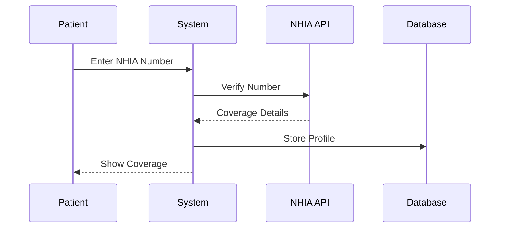
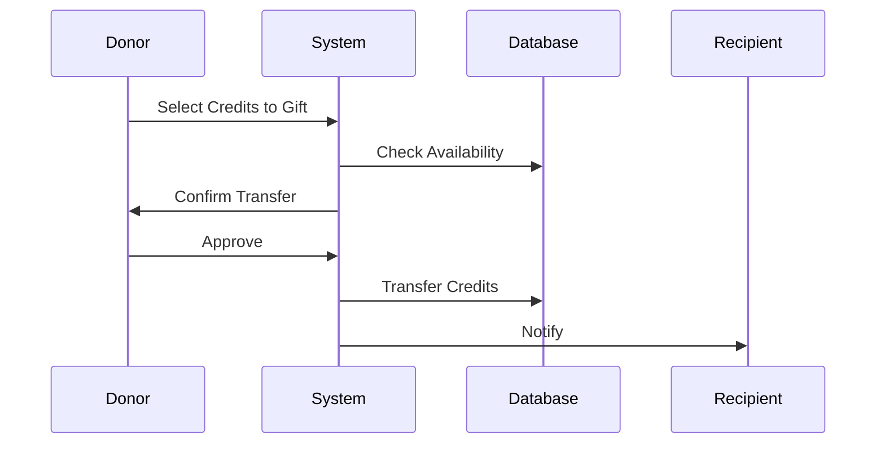

# Insurance Integration & Appointment Credits System 🏥

## Overview
This document outlines the strategy for implementing NHIA insurance integration and the innovative Appointment Credits System, allowing users to share their healthcare benefits with others.

## Table of Contents
1. [Insurance Integration](#insurance-integration)
2. [Appointment Credits System](#appointment-credits-system)
3. [Implementation Phases](#implementation-phases)
4. [Technical Architecture](#technical-architecture)
5. [User Flows](#user-flows)

## Insurance Integration 🔄

### 1. NHIA Integration Components

#### 1.1 Verification System
- NHIA number validation
- Real-time coverage checks
- Benefit package identification
- Service eligibility verification

#### 1.2 Coverage Types
- Basic Health Care Provision Fund (BHCPF)
- Formal Sector Social Health Insurance (FSSHIP)
- Vulnerable Group Fund (VGF)
- Group, Individual, Family Insurance (GIFSHIP)

#### 1.3 API Integration Points
- Verification endpoints
- Coverage checking
- Claims submission
- Payment reconciliation
- Status updates

### 2. Data Management

#### 2.1 Insurance Information Storage
```python
class InsuranceProfile:
    nhia_number: str
    package_type: str
    coverage_percentage: float
    annual_limit: decimal
    used_amount: decimal
    last_verification: datetime
    is_active: boolean
```

#### 2.2 Coverage Tracking
- Real-time balance updates
- Usage history
- Claim tracking
- Benefit utilization

## Appointment Credits System 🎁

### 1. Credit System Overview

#### 1.1 Credit Types
- Insurance-backed credits
- Purchased credits
- Gifted credits
- Corporate credits (from employers)

#### 1.2 Credit Properties
```python
class AppointmentCredit:
    credit_type: str
    amount: decimal
    expiry_date: datetime
    source: str  # insurance/purchase/gift
    restrictions: json
    transferable: boolean
```

### 2. Credit Sharing Features

#### 2.1 Gift Credits Flow
1. Donor selects credit amount
2. Chooses recipient (by phone/email)
3. Sets usage restrictions (if any)
4. Confirms transfer
5. Recipient notification

#### 2.2 Insurance-Backed Gifting
- Share unused insurance benefits
- Transfer coverage percentages
- Track shared benefits
- Maintain compliance records

#### 2.3 Credit Restrictions
- Service type limitations
- Expiry dates
- Usage frequency
- Department restrictions
- Value limits

### 3. Credit Management

#### 3.1 Credit Wallet
```python
class CreditWallet:
    user: User
    available_credits: decimal
    insurance_backed_credits: decimal
    purchased_credits: decimal
    gifted_credits: decimal
    credit_history: List[CreditTransaction]
```

#### 3.2 Credit Prioritization
1. Expiring credits first
2. Gifted credits
3. Insurance-backed credits
4. Purchased credits

## Implementation Phases 📅

### Phase 1: Foundation (Week 1-2)
- [ ] NHIA API integration
- [ ] Insurance profile management
- [ ] Basic credit system structure
- [ ] Database schema updates

### Phase 2: Core Features (Week 3-4)
- [ ] Credit wallet implementation
- [ ] Insurance verification flow
- [ ] Credit purchase system
- [ ] Basic gifting mechanism

### Phase 3: Advanced Features (Week 5-6)
- [ ] Insurance-backed gifting
- [ ] Credit restrictions
- [ ] Notification system
- [ ] Analytics dashboard

### Phase 4: Enhancement (Week 7-8)
- [ ] Mobile app integration
- [ ] Advanced reporting
- [ ] Corporate accounts
- [ ] Bulk credit management

## Technical Architecture 🏗️

### 1. Database Schema

#### 1.1 Insurance Tables
```sql
CREATE TABLE insurance_profiles (
    id SERIAL PRIMARY KEY,
    user_id INTEGER REFERENCES users(id),
    nhia_number VARCHAR(50) UNIQUE,
    package_type VARCHAR(20),
    coverage_percentage DECIMAL,
    annual_limit DECIMAL,
    used_amount DECIMAL,
    last_verification TIMESTAMP,
    is_active BOOLEAN
);

CREATE TABLE insurance_claims (
    id SERIAL PRIMARY KEY,
    profile_id INTEGER REFERENCES insurance_profiles(id),
    appointment_id INTEGER REFERENCES appointments(id),
    amount DECIMAL,
    status VARCHAR(20),
    submitted_at TIMESTAMP,
    processed_at TIMESTAMP
);
```

#### 1.2 Credits Tables
```sql
CREATE TABLE credit_wallets (
    id SERIAL PRIMARY KEY,
    user_id INTEGER REFERENCES users(id),
    total_credits DECIMAL,
    insurance_backed_credits DECIMAL,
    purchased_credits DECIMAL,
    gifted_credits DECIMAL,
    last_updated TIMESTAMP
);

CREATE TABLE credit_transactions (
    id SERIAL PRIMARY KEY,
    wallet_id INTEGER REFERENCES credit_wallets(id),
    transaction_type VARCHAR(20),
    amount DECIMAL,
    source_type VARCHAR(20),
    source_id INTEGER,
    recipient_id INTEGER REFERENCES users(id),
    restrictions JSONB,
    created_at TIMESTAMP
);
```

### 2. API Endpoints

#### 2.1 Insurance Endpoints
```python
# Insurance Management
POST /api/insurance/verify
GET /api/insurance/coverage
POST /api/insurance/claims
GET /api/insurance/claims/{id}/status

# Credit Management
GET /api/credits/balance
POST /api/credits/transfer
POST /api/credits/purchase
GET /api/credits/history
```

## User Flows 🌊

### 1. Insurance Verification Flow


### 2. Credit Gifting Flow


## Security Considerations 🔒

### 1. Data Protection
- Encryption of NHIA numbers
- Secure credit transactions
- Audit logging
- Access control

### 2. Fraud Prevention
- Transaction limits
- Verification checks
- Activity monitoring
- Suspicious activity detection

## Monitoring & Analytics 📊

### 1. Key Metrics
- Credit utilization rates
- Gifting patterns
- Insurance claim success rates
- User engagement

### 2. Reports
- Credit usage analytics
- Insurance coverage reports
- Gifting impact analysis
- ROI calculations

## Future Enhancements 🚀

### 1. Phase 5 Features
- Credit marketplace
- AI-powered recommendations
- Blockchain integration
- International insurance support

### 2. Integration Opportunities
- More insurance providers
- Payment gateways
- Healthcare providers
- Corporate wellness programs

## Support & Maintenance 🛠️

### 1. Regular Tasks
- Database optimization
- API performance monitoring
- Credit balance reconciliation
- Insurance verification updates

### 2. User Support
- Credit dispute resolution
- Insurance claim assistance
- Gift transfer support
- Technical support

## FAQ ❓

**Q: Can users gift insurance-backed credits?**
A: Yes, users can share their unused insurance benefits through the credit system.

**Q: How are gifted credits prioritized?**
A: Gifted credits are used after expiring credits but before insurance-backed credits.

**Q: Can credits expire?**
A: Yes, credits can have expiration dates based on their source and restrictions.

## Conclusion

This integrated system provides a unique approach to healthcare accessibility by combining traditional insurance with an innovative credit-sharing mechanism. Regular updates and user feedback will guide future enhancements. 