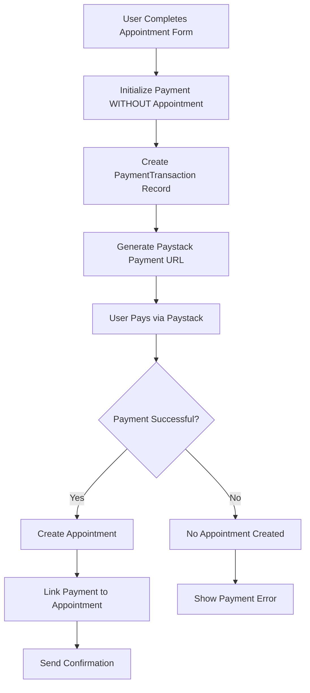

# PHB Hospital System - Payment Integration Documentation

**Version**: 2.0 (Payment-First Architecture)  
**Last Updated**: June 17, 2025  
**Authors**: Golden & Codey Development Team

---

## 📋 Table of Contents

1. [Overview](#overview)
2. [Architecture](#architecture)
3. [Payment Flow](#payment-flow)
4. [Backend Implementation](#backend-implementation)
5. [Frontend Implementation](#frontend-implementation)
6. [Database Schema](#database-schema)
7. [API Endpoints](#api-endpoints)
8. [Security Features](#security-features)
9. [Testing](#testing)
10. [Troubleshooting](#troubleshooting)
11. [Future Enhancements](#future-enhancements)

---

## 🔍 Overview

The PHB Hospital System implements a **Payment-First Architecture** to ensure zero unpaid appointments in the database. This approach prevents appointment creation until payment is successfully completed, maintaining data integrity and preventing revenue loss.

### Key Features
- ✅ **Zero Unpaid Appointments** - Appointments only created after successful payment
- ✅ **Multi-Provider Support** - Paystack (primary), with architecture for Flutterwave, Stripe, etc.
- ✅ **Enterprise Security** - Encrypted data, audit trails, fraud prevention
- ✅ **Real-time Verification** - Webhook-based payment confirmation
- ✅ **Comprehensive Logging** - Full audit trail for all payment activities

### Payment Providers
- **Primary**: Paystack (Nigerian market focus)
- **Planned**: Flutterwave, Stripe, Moniepoint
- **Architecture**: Provider-agnostic design for easy expansion

---

## 🏗️ Architecture

### Payment-First Flow Architecture



### Core Components

#### 1. PaymentTransaction Model
- Central payment tracking entity
- Supports nullable appointment (payment-first approach)
- Encrypted sensitive data
- Comprehensive audit trail

#### 2. Payment Providers System
- Abstract base class for provider implementations
- Current: PaystackProvider
- Pluggable architecture for adding new providers

#### 3. Payment Views (DRF APIViews)
- `PaymentInitializeView` - Start payment process
- `PaymentVerifyView` - Verify payment status
- `PaymentHistoryView` - User payment history
- `PaymentWebhookView` - Handle provider webhooks

#### 4. Frontend Payment Components
- `PaymentModal` - Paystack integration UI
- `PaymentConfirmation` - Success/failure handling
- `PaymentService` - API communication layer

---

## 🔄 Payment Flow

### 1. Payment Initialization (Frontend)
```javascript
// User submits appointment form
const paymentData = {
  urgency: 'routine',
  department: 'Cardiology',
  patientEmail: 'user@example.com',
  amount: 7500,
  currency: 'NGN'
  // NO appointmentId - payment-first approach!
};

const result = await PaymentService.initializePayment(paymentData);
```

### 2. Backend Payment Creation
```python
# Create PaymentTransaction without appointment
payment = PaymentTransaction.objects.create(
    patient=request.user,
    amount=float(amount),
    payment_method='card',
    payment_provider='paystack',
    currency='NGN',
    # appointment=None,  # Payment-first approach
    # hospital=None,     # Will be set after appointment creation
    created_by=request.user,
    last_modified_by=request.user
)
```

### 3. Paystack Integration
```python
# PaystackProvider initializes payment
data = {
    "email": self.transaction.patient.email,
    "amount": int(self.transaction.amount * 100),  # Kobo
    "currency": self.transaction.currency,
    "reference": self.transaction.transaction_id,
    "callback_url": self.config['callback_url'],
    "metadata": {
        "transaction_id": self.transaction.transaction_id,
        "patient_id": self.transaction.patient.id,
        "payment_type": "pre_appointment"  # No appointment yet
    }
}
```

### 4. Payment Success → Appointment Creation
```javascript
// After successful Paystack payment
const handlePaymentSuccess = async (transactionData) => {
  // NOW create the appointment
  const response = await fetch('/api/appointments/', {
    method: 'POST',
    body: JSON.stringify(appointmentPayload)
  });
  
  if (response.ok) {
    // Link payment to appointment (optional enhancement)
    console.log('✅ Payment + Appointment successful!');
  }
};
```

---

## 🛠️ Backend Implementation

### Database Models

#### PaymentTransaction Model
```python
class PaymentTransaction(models.Model):
    # Basic Information
    transaction_id = models.CharField(max_length=100, unique=True)
    appointment = models.ForeignKey(
        'api.Appointment', 
        on_delete=models.PROTECT,
        null=True, blank=True,  # 🎯 Payment-first approach
        related_name='payments'
    )
    patient = models.ForeignKey('api.CustomUser', on_delete=models.PROTECT)
    hospital = models.ForeignKey(
        'api.Hospital', 
        on_delete=models.PROTECT,
        null=True, blank=True,  # 🎯 Payment-first approach
        related_name='payments'
    )
    
    # Payment Details (Encrypted)
    _encrypted_amount = models.BinaryField(null=True, editable=False)
    amount_display = models.DecimalField(max_digits=10, decimal_places=2)
    currency = models.CharField(max_length=3, default='NGN')
    payment_method = models.CharField(max_length=50)
    payment_status = models.CharField(max_length=20, default='pending')
    
    # Provider Information
    payment_provider = models.CharField(max_length=50)
    provider_reference = models.CharField(max_length=100, null=True)
    
    # Security & Audit
    created_by = models.ForeignKey(get_user_model(), on_delete=models.PROTECT)
    status_change_history = models.JSONField(default=list)
    access_log = models.JSONField(default=list)
    
    # Timestamps
    created_at = models.DateTimeField(auto_now_add=True)
    updated_at = models.DateTimeField(auto_now=True)
    completed_at = models.DateTimeField(null=True, blank=True)
```

#### Key Model Features
- **Nullable Appointment**: Supports payment-first flow
- **Encrypted Amounts**: Django Signer for sensitive data
- **Audit Trail**: Complete history of status changes
- **Multi-Provider**: Supports various payment gateways

### Payment Views

#### PaymentInitializeView
```python
class PaymentInitializeView(APIView):
    permission_classes = [IsAuthenticated]
    
    def post(self, request):
        # Extract payment data
        appointment_id = request.data.get('appointment_id')  # Optional!
        amount = request.data.get('amount')
        
        # Create PaymentTransaction (appointment can be None)
        payment_data = {
            'patient': request.user,
            'amount': float(amount),
            'payment_method': 'card',
            'payment_provider': 'paystack',
            'currency': 'NGN',
            'created_by': request.user,
            'last_modified_by': request.user
        }
        
        # Only add appointment if provided
        if appointment_id:
            appointment = get_object_or_404(Appointment, id=appointment_id)
            payment_data['appointment'] = appointment
            payment_data['hospital'] = appointment.hospital
        
        payment = PaymentTransaction.objects.create(**payment_data)
        
        # Initialize with payment provider
        provider = payment.get_payment_provider()
        payment_url = provider.initialize_payment()
        
        return Response({
            'success': True,
            'payment_id': payment.transaction_id,
            'payment_url': payment_url,
            'provider_reference': payment.provider_reference
        })
```

### Payment Providers

#### PaystackProvider Implementation
```python
class PaystackProvider(BasePaymentProvider):
    def initialize_payment(self):
        """Initialize Paystack payment with conditional appointment data"""
        
        data = {
            "email": self.transaction.patient.email,
            "amount": int(self.transaction.amount * 100),
            "currency": self.transaction.currency,
            "reference": self.transaction.transaction_id,
            "callback_url": self.config['callback_url'],
            "metadata": {
                "transaction_id": self.transaction.transaction_id,
                "patient_id": self.transaction.patient.id,
                "ip_address": self.get_client_ip()
            }
        }
        
        # 🎯 Conditional appointment data
        if self.transaction.appointment:
            data["metadata"]["appointment_id"] = self.transaction.appointment.id
        else:
            data["metadata"]["payment_type"] = "pre_appointment"
        
        # Call Paystack API
        response = requests.post(
            self.api_urls['initialize'],
            headers={"Authorization": f"Bearer {self.config['secret_key']}"},
            json=data
        )
        
        result = response.json()
        self.transaction.provider_reference = result['data']['reference']
        self.transaction.save()
        
        return result['data']['authorization_url']
```

### Settings Configuration

#### Environment Variables
```python
# .env file
PAYSTACK_SECRET_KEY=sk_test_your_secret_key
PAYSTACK_PUBLIC_KEY=pk_test_your_public_key
PAYSTACK_WEBHOOK_SECRET=whsec_your_webhook_secret
PAYSTACK_CALLBACK_URL=http://localhost:5173/payment-callback
```

#### Django Settings
```python
# settings.py
PAYMENT_PROVIDERS = {
    'paystack': {
        'secret_key': os.environ.get('PAYSTACK_SECRET_KEY'),
        'public_key': os.environ.get('PAYSTACK_PUBLIC_KEY'),
        'webhook_secret': os.environ.get('PAYSTACK_WEBHOOK_SECRET'),
        'callback_url': os.environ.get('PAYSTACK_CALLBACK_URL'),
        'urls': {
            'initialize': 'https://api.paystack.co/transaction/initialize',
            'verify': 'https://api.paystack.co/transaction/verify',
            'refund': 'https://api.paystack.co/refund'
        }
    }
}
```

---

## 💻 Frontend Implementation

### Payment Service
```javascript
// services/paymentService.ts
export const PaymentService = {
  async initializePayment(paymentData) {
    const requestBody = {
      amount: calculateAppointmentPrice(paymentData),
      payment_method: 'card',
      payment_provider: 'paystack'
    };
    
    // Only add appointment_id if it exists (payment-first approach)
    if (paymentData.appointmentId) {
      requestBody.appointment_id = paymentData.appointmentId;
    }
    
    const response = await apiRequest('/api/payments/initialize/', 'POST', requestBody);
    return response;
  },
  
  async verifyPayment(reference) {
    return await apiRequest(`/api/payments/verify/${reference}/`, 'GET');
  }
};
```

### Payment Modal Component
```javascript
// components/modals/PaymentModal.tsx
const PaymentModal = ({ appointmentData, onPaymentSuccess }) => {
  const initializePaystackPayment = () => {
    // Use backend reference if provided, otherwise generate frontend reference
    const reference = appointmentData.paymentReference || generateTransactionReference();
    
    const handler = window.PaystackPop.setup({
      key: 'pk_test_your_public_key',
      email: appointmentData.patientEmail,
      amount: appointmentData.amount * 100,
      currency: 'NGN',
      ref: reference,
      callback: function(response) {
        if (response.status === 'success') {
          verifyPayment(response.reference, response);
        }
      }
    });
    
    handler.openIframe();
  };
  
  const verifyPayment = async (reference, paymentResponse) => {
    const result = await PaymentService.verifyPayment(reference);
    if (result.status === 'success') {
      onPaymentSuccess({...result.data, paystack_response: paymentResponse});
    }
  };
};
```

### Appointment Booking Flow
```javascript
// features/health/BookAppointment.tsx
const handleSubmit = async (e) => {
  e.preventDefault();
  
  // Store appointment data for AFTER payment
  setAppointmentPayload(appointmentRequestBody);
  
  // Initialize payment WITHOUT creating appointment
  const paymentResult = await PaymentService.initializePayment({
    urgency: formData.urgency,
    department: departmentName,
    patientEmail: user?.email,
    amount: calculateAppointmentPrice(paymentData)
    // NO appointmentId - payment-first approach!
  });
  
  // Show payment modal with backend reference
  const appointmentDataForPayment = {
    amount: calculateAppointmentPrice(paymentData),
    paymentReference: paymentResult.data.reference  // Backend reference!
  };
  
  setPaymentModalData(appointmentDataForPayment);
  setShowPaymentModal(true);
};

const handlePaymentSuccess = async (transactionData) => {
  // NOW create appointment after successful payment
  const response = await fetch('/api/appointments/', {
    method: 'POST',
    body: JSON.stringify(appointmentPayload)
  });
  
  if (response.ok) {
    setPaymentStatus('success');
  } else {
    // Payment succeeded but appointment failed - contact support
    setPaymentStatus('failed');
    setSubmissionError('Payment successful but appointment creation failed. Contact support with reference: ' + transactionData.reference);
  }
};
```

---

## 🗄️ Database Schema

### Migration for Payment-First Approach
```python
# api/migrations/0022_alter_paymenttransaction_appointment_and_more.py
from django.db import migrations, models

class Migration(migrations.Migration):
    dependencies = [
        ('api', '0021_previous_migration'),
    ]

    operations = [
        migrations.AlterField(
            model_name='paymenttransaction',
            name='appointment',
            field=models.ForeignKey(
                blank=True, null=True,
                on_delete=django.db.models.deletion.PROTECT,
                related_name='payments', to='api.appointment',
                help_text='Associated appointment (optional for payment-first flow)'
            ),
        ),
        migrations.AlterField(
            model_name='paymenttransaction',
            name='hospital',
            field=models.ForeignKey(
                blank=True, null=True,
                on_delete=django.db.models.deletion.PROTECT,
                related_name='payments', to='api.hospital',
                help_text='Associated hospital (optional for payment-first flow)'
            ),
        ),
    ]
```

### Key Schema Features

#### PaymentTransaction Table
```sql
CREATE TABLE api_paymenttransaction (
    id SERIAL PRIMARY KEY,
    transaction_id VARCHAR(100) UNIQUE NOT NULL,
    appointment_id INTEGER NULL,  -- 🎯 Nullable for payment-first
    patient_id INTEGER NOT NULL,
    hospital_id INTEGER NULL,     -- 🎯 Nullable for payment-first
    _encrypted_amount BYTEA NULL,
    amount_display DECIMAL(10,2) NOT NULL,
    currency VARCHAR(3) DEFAULT 'NGN',
    payment_method VARCHAR(50) NOT NULL,
    payment_status VARCHAR(20) DEFAULT 'pending',
    payment_provider VARCHAR(50) NULL,
    provider_reference VARCHAR(100) NULL,
    created_by_id INTEGER NOT NULL,
    last_modified_by_id INTEGER NOT NULL,
    status_change_history JSONB DEFAULT '[]',
    access_log JSONB DEFAULT '[]',
    created_at TIMESTAMP WITH TIME ZONE NOT NULL,
    updated_at TIMESTAMP WITH TIME ZONE NOT NULL,
    completed_at TIMESTAMP WITH TIME ZONE NULL
);
```

#### Indexes for Performance
```sql
CREATE INDEX idx_paymenttransaction_transaction_id ON api_paymenttransaction(transaction_id);
CREATE INDEX idx_paymenttransaction_status ON api_paymenttransaction(payment_status);
CREATE INDEX idx_paymenttransaction_created_at ON api_paymenttransaction(created_at);
CREATE INDEX idx_paymenttransaction_patient ON api_paymenttransaction(patient_id);
CREATE INDEX idx_paymenttransaction_provider_ref ON api_paymenttransaction(provider_reference);
```

---

## 🔌 API Endpoints

### Payment Initialization
```http
POST /api/payments/initialize/
Content-Type: application/json
Authorization: Bearer <jwt_token>

{
  "amount": 7500,
  "payment_method": "card",
  "payment_provider": "paystack",
  "appointment_id": null  // Optional - payment-first approach
}

Response:
{
  "success": true,
  "payment_id": "TXN-E742A3F30B2E",
  "payment_url": "https://checkout.paystack.com/t2rkdgw7yfoje4s",
  "provider_reference": "TXN-E742A3F30B2E",
  "amount": 7500,
  "currency": "NGN"
}
```

### Payment Verification
```http
GET /api/payments/verify/{reference}/
Authorization: Bearer <jwt_token>

Response:
{
  "success": true,
  "payment_id": "TXN-E742A3F30B2E",
  "status": "completed",
  "amount": 7500,
  "currency": "NGN",
  "completed_at": "2025-06-17T09:58:16.055892Z",
  "verification_data": {...}
}
```

### Payment History
```http
GET /api/payments/history/
Authorization: Bearer <jwt_token>

Response:
{
  "success": true,
  "payments": [
    {
      "transaction_id": "TXN-E742A3F30B2E",
      "amount": 7500,
      "status": "completed",
      "created_at": "2025-06-17T09:58:16.055892Z",
      "appointment": {...}
    }
  ],
  "count": 1
}
```

### Webhook Endpoint
```http
POST /api/payments/webhook/
X-Paystack-Signature: <webhook_signature>

{
  "event": "charge.success",
  "data": {
    "reference": "TXN-E742A3F30B2E",
    "amount": 750000,
    "status": "success",
    "metadata": {...}
  }
}
```

---

## 🔒 Security Features

### Data Encryption
```python
# Encrypted amount storage
@property
def amount(self):
    """Decrypt and return the actual amount"""
    if self._encrypted_amount:
        return float(self._signer.unsign(self._encrypted_amount.decode()))
    return float(self.amount_display)

@amount.setter
def amount(self, value):
    """Encrypt and store the amount"""
    self.amount_display = value
    self._encrypted_amount = self._signer.sign(str(value)).encode()
```

### Webhook Signature Verification
```python
def verify_webhook_signature(self, signature, payload):
    """Verify Paystack webhook signature"""
    secret = self.config['webhook_secret'].encode()
    computed = hmac.new(secret, payload.encode(), hashlib.sha512).hexdigest()
    return hmac.compare_digest(computed, signature)
```

### Access Control
```python
# Permission-based access
class Meta:
    permissions = [
        ("can_view_sensitive_data", "Can view sensitive transaction data"),
        ("can_process_refunds", "Can process refunds"),
        ("can_view_audit_trail", "Can view transaction audit trail"),
    ]
```

### Anti-Fraud Measures
- Device fingerprinting (metadata)
- IP address logging
- Rate limiting (403 Forbidden for rapid requests)
- Amount validation
- Duplicate payment prevention

---

## 🧪 Testing

### Backend Tests
```python
# tests/test_payment_views.py
class PaymentInitializeTest(APITestCase):
    def test_payment_without_appointment(self):
        """Test payment-first approach"""
        response = self.client.post('/api/payments/initialize/', {
            'amount': 7500,
            'payment_method': 'card',
            'payment_provider': 'paystack'
            # No appointment_id
        })
        
        self.assertEqual(response.status_code, 201)
        self.assertIn('payment_id', response.data)
        
        # Verify PaymentTransaction created without appointment
        payment = PaymentTransaction.objects.get(
            transaction_id=response.data['payment_id']
        )
        self.assertIsNone(payment.appointment)
        self.assertIsNone(payment.hospital)
```

### Frontend Tests
```javascript
// tests/PaymentService.test.js
describe('PaymentService', () => {
  it('should initialize payment without appointment', async () => {
    const paymentData = {
      urgency: 'routine',
      department: 'Cardiology',
      amount: 7500
      // No appointmentId
    };
    
    const result = await PaymentService.initializePayment(paymentData);
    
    expect(result.status).toBe('success');
    expect(result.data.payment_id).toBeDefined();
    expect(result.data.payment_url).toContain('paystack.com');
  });
});
```

### Manual Testing Scenarios
1. **Payment-First Success Flow**
   - Initialize payment without appointment
   - Complete Paystack payment
   - Verify appointment creation after payment

2. **Payment Failure Flow**
   - Initialize payment
   - Cancel/fail Paystack payment
   - Verify no appointment created

3. **Rate Limiting Test**
   - Multiple rapid payment attempts
   - Verify 403 Forbidden response

4. **Security Tests**
   - Invalid webhook signatures
   - Unauthorized API access
   - Data encryption verification

---

## 🔧 Troubleshooting

### Common Issues

#### 1. 403 Forbidden on Payment Initialization
**Symptoms**: `"POST /api/payments/initialize/ HTTP/1.1" 403 28`

**Causes**:
- Rate limiting (too many requests)
- Duplicate payment prevention
- Previous pending payment

**Solutions**:
```python
# Check for pending payments
pending_payments = PaymentTransaction.objects.filter(
    patient=user,
    payment_status='pending',
    created_at__gte=timezone.now() - timedelta(minutes=5)
)
```

#### 2. PaymentTransaction Creation Fails
**Symptoms**: Database constraint violations

**Causes**:
- Missing migrations
- Null constraint issues

**Solutions**:
```bash
# Apply migrations
python manage.py makemigrations
python manage.py migrate
```

#### 3. Paystack Integration Errors
**Symptoms**: "Invalid key" or API errors

**Causes**:
- Wrong API keys
- Environment variable issues

**Solutions**:
```python
# Debug API keys
print(f"Paystack Secret: {settings.PAYMENT_PROVIDERS['paystack']['secret_key'][:10]}...")
print(f"Paystack Public: {settings.PAYMENT_PROVIDERS['paystack']['public_key'][:10]}...")
```

#### 4. Frontend Payment Modal Issues
**Symptoms**: Modal doesn't show or payment fails

**Causes**:
- Missing paymentReference
- API response format mismatch

**Solutions**:
```javascript
// Debug payment data
console.log('Payment modal data:', paymentModalData);
console.log('Backend reference:', paymentModalData?.paymentReference);
```

### Debugging Tools

#### Backend Logging
```python
# Enhanced payment logging
logger.info(f"Payment initialization: user={request.user.id}, amount={amount}")
logger.info(f"PaymentTransaction created: {payment.transaction_id}")
logger.info(f"Paystack response: {response.status_code}")
```

#### Frontend Debugging
```javascript
// Payment flow debugging
console.log('🚀 Initializing payment:', paymentData);
console.log('✅ Payment initialized:', paymentResult);
console.log('💳 Paystack callback:', response);
console.log('🏥 Creating appointment:', appointmentPayload);
```

---

## 🚀 Future Enhancements

### Planned Features

#### 1. Payment-Appointment Linking
```python
# Enhanced appointment creation with payment linking
def link_payment_to_appointment(payment_id, appointment_id):
    payment = PaymentTransaction.objects.get(transaction_id=payment_id)
    appointment = Appointment.objects.get(id=appointment_id)
    
    payment.appointment = appointment
    payment.hospital = appointment.hospital
    payment.save()
```

#### 2. Multiple Payment Providers
```python
# Extended provider support
PAYMENT_PROVIDERS = {
    'paystack': PaystackProvider,
    'flutterwave': FlutterwaveProvider,
    'stripe': StripeProvider,
    'moniepoint': MoniepointProvider
}
```

#### 3. Payment Plans & Subscriptions
```python
class PaymentPlan(models.Model):
    name = models.CharField(max_length=100)  # "Basic", "Premium", "Platinum"
    price = models.DecimalField(max_digits=10, decimal_places=2)
    features = models.JSONField()
    billing_cycle = models.CharField(max_length=20)  # "monthly", "yearly"
```

#### 4. Advanced Analytics
```python
class PaymentAnalytics(models.Model):
    date = models.DateField()
    total_revenue = models.DecimalField(max_digits=12, decimal_places=2)
    transaction_count = models.IntegerField()
    success_rate = models.FloatField()
    provider_breakdown = models.JSONField()
```

#### 5. Refund System Enhancement
```python
def process_refund(payment_id, amount=None, reason=None):
    payment = PaymentTransaction.objects.get(transaction_id=payment_id)
    provider = payment.get_payment_provider()
    
    refund_result = provider.refund_payment(amount)
    
    # Create refund record
    Refund.objects.create(
        original_payment=payment,
        amount=amount or payment.amount,
        reason=reason,
        provider_response=refund_result
    )
```

### Technical Improvements

#### 1. Async Payment Processing
```python
# Celery task for payment processing
@shared_task
def process_payment_async(payment_id):
    payment = PaymentTransaction.objects.get(transaction_id=payment_id)
    provider = payment.get_payment_provider()
    result = provider.initialize_payment()
    return result
```

#### 2. Enhanced Error Handling
```python
class PaymentError(Exception):
    def __init__(self, message, error_code, provider_response=None):
        self.message = message
        self.error_code = error_code
        self.provider_response = provider_response
        super().__init__(self.message)
```

#### 3. Webhook Queue System
```python
# Queue webhook processing for reliability
@shared_task(bind=True, max_retries=3)
def process_webhook(self, webhook_data):
    try:
        # Process webhook
        payment = PaymentTransaction.objects.get(
            provider_reference=webhook_data['data']['reference']
        )
        provider = payment.get_payment_provider()
        provider.process_webhook(webhook_data)
    except Exception as exc:
        self.retry(countdown=60, exc=exc)
```

---

## 📝 Changelog

### Version 2.0 (June 17, 2025)
- ✅ **MAJOR**: Implemented Payment-First Architecture
- ✅ **FEATURE**: Zero unpaid appointments guarantee
- ✅ **ENHANCEMENT**: Nullable appointment fields in PaymentTransaction
- ✅ **FEATURE**: Enhanced PaystackProvider with conditional appointment handling
- ✅ **SECURITY**: Rate limiting and duplicate payment prevention
- ✅ **DOCS**: Comprehensive documentation system

### Version 1.0 (Previous)
- ✅ Basic payment integration
- ✅ Paystack provider implementation
- ✅ PaymentTransaction model with encryption
- ✅ Frontend payment modal
- ✅ Webhook handling

---

## 👥 Contributors

- **Golden** (eruwagolden55@gmail.com) - Project Lead & Backend Architecture
- **Codey** - Payment Integration Specialist & Documentation

---

## 📞 Support

For technical support or questions about the payment system:

1. **Check this documentation first**
2. **Review troubleshooting section**
3. **Check system logs for detailed error information**
4. **Contact development team with specific error details**

---

## 📄 License

This payment system is part of the PHB Hospital System project.  
Confidential and proprietary - not for distribution.

---

*Last updated: June 17, 2025*  
*Documentation version: 2.0*
